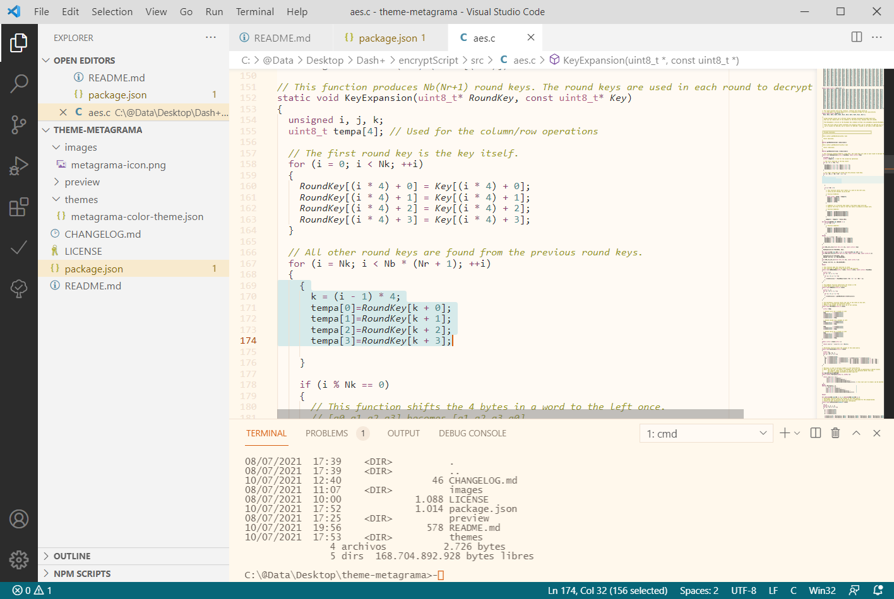

# Metagrama theme for VS Code

Metagrama is a light theme for [Visual Studio Code](https://code.visualstudio.com/) which takes a notable chromatic inspiration from [*Gruvbox*](https://github.com/morhetz/gruvbox), [*Solarized*](https://ethanschoonover.com/solarized/), and other soothing color palettes, but still providing its own subtle tweaks.

It is intended to provide a calm code (or narrative) writing and reading experience, by using a balanced contrast to reduce eyestrain without sacrificing readability. It should also be comfortable for people with astigmatism.

In order to mantain some degree of sobriety and avoid the *"candy shop syndrome"*, it intentionally renounces the colorization of a few second order syntactic elements.

## Preview

## License

This theme and all its associated contents are provided under a [MIT license](https://opensource.org/licenses/MIT).

## Contact & resources 

* Author: Luis Pabón ([Zentropia](https://github.com/zentropia))
* Source code: https://github.com/zentropia/vscode-theme-metagrama
